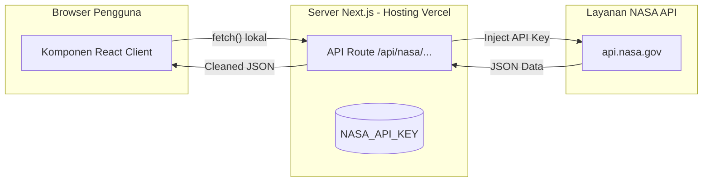

# 🌌 Masterplan Pengembangan Integrasi NASA API — Meteorit Indonesia

Dokumen ini berfungsi sebagai rencana induk (masterplan) dan panduan arsitektur jangka panjang untuk mengintegrasikan berbagai data observasi luar angkasa milik **NASA** ke dalam portal **Meteorit Indonesia**.

---

## 🧭 Visi & Arah Strategis
Mengubah portal **Meteorit Indonesia** dari sebuah katalog meteorit statis dan forum lokal menjadi sebuah **Pusat Komunitas & Dasbor Pemantauan Benda Langit Terintegrasi**. Penambahan data NASA API secara real-time/cached bertujuan meningkatkan:
* **Tingkat Kunjungan Pengguna (Traffic):** Konten dinamis harian menarik pengunjung kembali setiap hari.
* **Nilai Edukasi:** Memberikan edukasi sains tingkat tinggi yang kredibel dari lembaga antariksa dunia.
* **Keterlibatan Pengguna:** Memberikan pengalaman dasbor interaktif yang canggih (pemantauan asteroid, cuaca luar angkasa, bola api jatuh).

---

## 🛠️ Standar Arsitektur & Keamanan

Untuk menghindari pemblokiran API (*Rate Limit*) dan kebocoran *API Key* NASA di sisi browser, seluruh integrasi wajib mematuhi standar arsitektur berikut:



### 1. Zero Browser Exposure (Keamanan API Key)
* **Aturan:** Dilarang keras memanggil `api.nasa.gov` langsung dari client (`"use client"`).
* **Solusi:** API Key NASA disimpan di Vercel Environment Variables (`NASA_API_KEY`). Next.js membuat backend API endpoint (contoh: `/api/nasa/neo`) yang membaca variabel tersebut, memanggil server NASA, dan mengembalikan data bersih ke client.

### 2. Smart Caching (Firestore & Cloudflare R2)
* Limit gratis NASA API adalah **1.000 request per jam**. Jika trafik web Anda tinggi, batas ini akan habis dalam hitungan menit.
* **Solusi:** Untuk data harian atau bulanan (seperti APOD, Mars Rover, Fireball), server Next.js akan menyimpan salinan datanya di Firestore atau Cloudflare R2 saat pertama kali dipanggil hari itu (*On-demand Caching*), atau menggunakan Cron Job harian. Request berikutnya dari pengguna akan dilayani langsung dari Firestore/R2.

---

## 🗺️ Peta Jalan (Roadmap) Tahapan Pengembangan

```
TAHAP 1: Kemanan & Pondasi (Sekarang)
 └── Amankan API Key StatsBanner & Pindahkan ke Server-Side API

TAHAP 2: Dashboard Real-time (Jangka Pendek)
 └── Rilis Halaman Pemantau Asteroid (NeoWs) & Laporan Bola Api (Fireball)

TAHAP 3: Cuaca Luar Angkasa & Edukasi (Jangka Menengah)
 └── Rilis Monitor Badai Matahari (DONKI) & Arsip Media NASA

TAHAP 4: Integrasi Komunitas (Jangka Panjang)
 └── Peringatan Dini (Early Warning System) & Notifikasi via Email/Telegram
```

### Tahap 1: Keamanan & Pondasi (Jangka Pendek)
* **Tujuan:** Membersihkan kode saat ini dari celah keamanan.
* **Tugas:**
  * Memindahkan pemanggilan API NeoWs di `StatsBanner.tsx` ke endpoint server `/api/nasa/stats`.
  * Membaca `NASA_API_KEY` secara aman dari server-side environment.

### Tahap 2: Asteroid & Meteor Tracker (Jangka Pendek - Menengah)
* **Tujuan:** Meluncurkan halaman interaktif baru `/monitoring`.
* **Fitur:**
  * **NeoWs Tracker:** Menampilkan daftar asteroid terdekat hari ini. Memberikan label status visual: `Bahaya Melintas (Merah)` vs `Melintas Aman (Cyan)`.
  * **Fireball Data Feed:** Menampilkan list/tabel kejadian meteor besar yang jatuh ke bumi dalam 30 hari terakhir (kecepatan, energi ledakan, dan estimasi koordinat lokasi jatuh).

### Tahap 3: Cuaca Antariksa & Galeri Kosmos (Jangka Menengah)
* **Tujuan:** Menambah konten multimedia yang memukau pengguna.
* **Fitur:**
  * **Space Weather (DONKI):** Tampilan infografis aktivitas badai matahari (Solar Flare & CME) dengan indikator status aktivitas (Rendah, Sedang, Tinggi).
  * **Mars Rover Explorations:** Galeri foto permukaan planet Mars yang di-update berkala sesuai transmisi terbaru dari Rover Curiosity/Perseverance.

### Tahap 4: Sistem Notifikasi & Peringatan Dini (Jangka Panjang)
* **Tujuan:** Membangun loyalitas pengguna melalui interaksi otomatis.
* **Fitur:**
  * Integrasi data NeoWs/DONKI dengan pengiriman newsletter otomatis jika ada asteroid berukuran besar yang melintas sangat dekat, atau jika terjadi badai matahari kuat yang berpotensi memicu Aurora di wilayah lintang rendah/gangguan satelit komunikasi.

---

## 📋 Pemetaan Endpoint NASA API

Berikut adalah endpoint spesifik NASA yang akan digunakan beserta fungsinya:

| Nama Layanan | Endpoint NASA API | Parameter Utama | Frekuensi Update | Manfaat Fitur |
| :--- | :--- | :--- | :--- | :--- |
| **NeoWs** | `/neo/rest/v1/feed` | `start_date`, `end_date` | Harian | Jumlah asteroid, jarak terdekat, diameter, & potensi bahaya. |
| **Fireball** | `https://ssd-api.jpl.nasa.gov/fireball.api` | `limit`, `sort` | Berkala | Catatan energi ledakan bola api meteor yang memasuki atmosfer. |
| **DONKI** | `/DONKI/CME` & `/DONKI/FLR` | `startDate`, `endDate` | Real-time | Pemantauan ejeksi massa korona matahari (CME) & flare matahari. |
| **Mars Rover** | `/mars-photos/api/v1/rovers/curiosity/photos` | `sol`, `camera` | Harian | Galeri foto mentah permukaan Mars untuk pencinta eksplorasi. |
| **EPIC** | `/EPIC/api/natural` | Tanpa parameter | Harian | Foto bumi full-disk resolusi tinggi dari satelit DSCOVR. |

---

## 🎨 Konsep Desain Antarmuka (UI) Dashboard `/monitoring`

Desain dashboard baru wajib memiliki kesan premium, futuristik, dan *alive* (hidup). Berikut panduan visualnya:

### 1. Warna & Tipografi
* **Background:** Dark slate ultra gelap (`bg-slate-950`).
* **Accent Colors:** Neon Cyan (`#22d3ee` - Keadaan aman/teknologi), Amber/Orange (`#f59e0b` - Keadaan waspada/data penting), Crimson Red (`#ef4444` - Potensi bahaya/peringatan).
* **Typography:** Menggunakan font modern tanpa kaki (sans-serif) seperti **Inter** atau **Outfit** untuk angka statistik yang tebal dan futuristik.

### 2. Glassmorphism Card Style
Seluruh panel statistik menggunakan panel kaca transparan dengan border neon tipis:
```css
.dashboard-card {
  background: rgba(15, 23, 42, 0.4);
  backdrop-filter: blur(12px);
  border: 1px solid rgba(34, 211, 238, 0.1);
  border-radius: 24px;
  transition: all 0.3s cubic-bezier(0.4, 0, 0.2, 1);
}
.dashboard-card:hover {
  border-color: rgba(34, 211, 238, 0.3);
  box-shadow: 0 10px 30px -10px rgba(34, 211, 238, 0.15);
  transform: translateY(-2px);
}
```

### 3. Animasi Interaktif
* **Blinking Beacon:** Gunakan animasi `animate-ping` lambat pada titik koordinat peta bola api jatuh atau indikator asteroid berbahaya untuk menarik perhatian visual secara elegan.
* **Simulasi Orbit Sederhana:** Menggunakan SVG animasi CSS berputar (rotation) untuk memvisualisasikan orbit asteroid yang melintasi bumi secara interaktif di sisi kanan kartu detail asteroid.

---

## 📈 SEO & Optimasi Performa

* **Static Site Generation (SSG) dengan Revalidation:** Gunakan Next.js Incremental Static Regeneration (ISR) pada halaman `/monitoring`. Halaman akan dibangun secara statis untuk performa loading secepat kilat (FCP < 1 detik) namun akan di-update di latar belakang setiap 1 jam (`revalidate: 3600`).
* **Dynamic SEO Metadata:** Dapatkan jumlah asteroid hari ini secara dinamis untuk disisipkan ke dalam meta description, contoh:
  > *"Pantau 12 Asteroid yang melintasi dekat Bumi hari ini secara real-time. Dapatkan info kecepatan, jarak melintas, dan peta sebaran bola api jatuh di Meteorit Indonesia."*
  Ini sangat disukai oleh mesin pencari Google karena konten deskripsi selalu segar dan aktual setiap hari.
